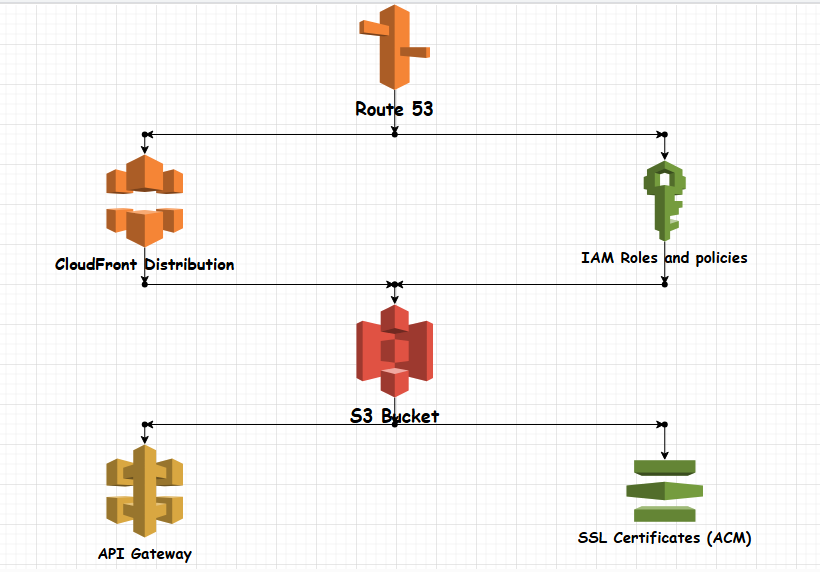

# Static Website Deployment with Terraform

This project outlines how to deploy a static website on AWS using Terraform. The infrastructure includes an S3 bucket for hosting website files, CloudFront for content delivery, Route 53 for domain name management, IAM roles and policies for security, API Gateway for handling HTTP requests, and SSL certificates for HTTPS.

## Prerequisites
- **AWS Account**: You need an active AWS account to deploy the resources.
- **Domain name registered in Route 53**: Ensure your domain name is registered and managed by AWS Route 53.
- **Terraform installed on your local machine**: Install Terraform on your machine. Follow the instructions on the [Terraform website](https://www.terraform.io/downloads.html).

## Project Structure
The project consists of the following Terraform configuration files and directories:

- **`api_gateway_config.tf`**: Configuration for API Gateway including REST API setup, deployment, and stage.
- **`api_gateway_resources.tf`**: Definitions for API Gateway resources such as methods and integrations.
- **`certificate.tf`**: SSL certificate configuration using AWS Certificate Manager (ACM).
- **`data.tf`**: Data sources used in the Terraform project to fetch information about existing AWS resources.
- **`init.tf`**: Initialization configuration for Terraform backend and AWS provider.
- **`main.tf`**: Main Terraform configuration file that integrates all modules.
- **`outputs.tf`**: Defines output variables to display useful information after deployment.
- **`permissions.tf`**: IAM roles and policies to secure the S3 bucket and CloudFront distribution.
- **`README.md`**: Project documentation with detailed instructions on setting up and deploying the infrastructure.
- **`route53.tf`**: Route 53 DNS configuration to manage the custom domain.
- **`variables.tf`**: Variables used across the Terraform project for easy customization.
- **`s3-static-website.png`**: Diagram illustrating the infrastructure setup.

### Modules
The project uses modules to organize and reuse code:

- **`modules/s3_bucket`**: Manages the S3 bucket for hosting the static website.
- **`modules/cloudfront`**: Manages the CloudFront distribution for content delivery.
- **`modules/route53`**: Manages the Route 53 DNS records.
- **`modules/certificate`**: Manages the SSL certificate using AWS Certificate Manager (ACM).

## Steps to Deploy

1. **Initialize the Terraform Project**
   Initialize the Terraform project to install necessary providers and modules.

   ```sh
   terraform init
   ```

2. **Configure AWS S3 Bucket**
   Create an S3 bucket to host the static website. This step includes setting up the bucket policy to make it publicly accessible and defining the `index.html` and `error.html` as the default documents.

3. **Set Up CloudFront Distribution**
   Create a CloudFront distribution to serve the content from the S3 bucket. This includes configuring the default root object, integrating the SSL certificate for HTTPS, and setting up the origin access identity.

4. **Manage Domain with Route 53**
   Configure Route 53 to manage the custom domain. Create DNS records to point to the CloudFront distribution, ensuring the website is accessible via the custom domain.

5. **Security and Access Management**
   Define IAM roles and policies to secure the S3 bucket and CloudFront distribution. Implement least privilege access for IAM roles to enhance security.

6. **API Gateway Configuration**
   Configure API Gateway to handle HTTP requests. Define necessary resources and methods in `api_gateway_resources.tf`.

7. **SSL Certificate Configuration**
   Request and validate an SSL certificate using ACM. Attach the SSL certificate to the CloudFront distribution to enable HTTPS.

8. **Deployment and Testing**
   Deploy the infrastructure using Terraform. Apply the Terraform configuration and verify the deployment by accessing the website via the custom domain.

   ```sh
   terraform apply
   ```

## Diagram


The diagram above illustrates the infrastructure setup, including the S3 bucket, CloudFront distribution, Route 53 DNS configuration, IAM roles and policies, API Gateway, and SSL certificates.

---

### Detailed Configuration Files

#### `api_gateway_config.tf`
Defines the configuration for API Gateway, including REST API setup, deployment, and stage configuration.

```hcl
resource "aws_api_gateway_rest_api" "api" {
  name        = "StaticWebsiteAPI"
  description = "API for the static website"
}

resource "aws_api_gateway_deployment" "deployment" {
  depends_on = [aws_api_gateway_method.method]
  rest_api_id = aws_api_gateway_rest_api.api.id
  stage_name  = "prod"
}

resource "aws_api_gateway_stage" "stage" {
  stage_name    = "prod"
  rest_api_id   = aws_api_gateway_rest_api.api.id
  deployment_id = aws_api_gateway_deployment.deployment.id
}
```

#### `api_gateway_resources.tf`
Defines the resources for API Gateway, including methods and integrations.

```hcl
resource "aws_api_gateway_resource" "resource" {
  rest_api_id = aws_api_gateway_rest_api.api.id
  parent_id   = aws_api_gateway_rest_api.api.root_resource_id
  path_part   = "path"
}

resource "aws_api_gateway_method" "method" {
  rest_api_id   = aws_api_gateway_rest_api.api.id
  resource_id   = aws_api_gateway_resource.resource.id
  http_method   = "GET"
  authorization = "NONE"
}

resource "aws_api_gateway_integration" "integration" {
  rest_api_id = aws_api_gateway_rest_api.api.id
  resource_id = aws_api_gateway_resource.resource.id
  http_method = aws_api_gateway_method.method.http_method
  type        = "MOCK"
}
```

#### `certificate.tf`
Configures the SSL certificate using AWS Certificate Manager (ACM).

```hcl
resource "aws_acm_certificate" "this" {
  domain_name       = var.domain_name
  validation_method = "DNS"

  lifecycle {
    create_before_destroy = true
  }
}

resource "aws_route53_record" "validation" {
  for_each = {
    for dvo in aws_acm_certificate.this.domain_validation_options : dvo.domain_name => {
      name   = dvo.resource_record_name
      type   = dvo.resource_record_type
      record = dvo.resource_record_value
    }
  }

  zone_id = var.zone_id
  name    = each.value.name
  type    = each.value.type
  ttl     = 60
  records = [each.value.record]
}

resource "aws_acm_certificate_validation" "this" {
  certificate_arn         = aws_acm_certificate.this.arn
  validation_record_fqdns = [for record in aws_route53_record.validation : record.fqdn]
}
```

#### `data.tf`
Defines data sources to fetch information about existing AWS resources.

```hcl
data "aws_route53_zone" "selected" {
  name = var.domain_name
}
```

#### `init.tf`
Initializes the Terraform backend and AWS provider.

```hcl
terraform {
  required_version = ">= 0.12"
  backend "s3" {
    bucket = "your-terraform-state-bucket"
    key    = "path/to/terraform.tfstate"
    region = "us-east-1"
  }
}

provider "aws" {
  region = "us-east-1"
}
```

#### `main.tf`
Main Terraform configuration file integrating all modules.

```hcl
module "s3_bucket" {
  source = "./modules/s3_bucket"
  name   = var.bucket_name
}

module "certificate" {
  source    = "./modules/certificate"
  domain_name = var.domain_name
  zone_id     = var.zone_id
}

module "cloudfront" {
  source               = "./modules/cloudfront"
  s3_bucket_domain_name = module.s3_bucket.bucket_name
  origin_id            = var.origin_id
  domain_name          = var.domain_name
  acm_certificate_arn  = module.certificate.acm_certificate_arn
}

module "route53" {
  source                   = "./modules/route53"
  zone_id                  = var.zone_id
  name                     = var.domain_name
  cloudfront_domain_name   = module.cloudfront.cloudfront_domain_name
  cloudfront_hosted_zone_id = "Z2FDTNDATAQYW2"  # CloudFront hosted zone ID
}
```

#### `outputs.tf`
Defines output variables to display useful information after deployment.

```hcl
output "s3_bucket_name" {
  value = module.s3_bucket.bucket_name
}

output "cloudfront_distribution_id" {
  value = module.cloudfront.cloudfront_distribution_id
}

output "cloudfront_domain_name" {
  value = module.cloudfront.cloudfront_domain_name
}

output "route53_record" {
  value = module.route53.route53_record
}
```

#### `permissions.tf`
Defines IAM roles and policies to secure the S3 bucket and CloudFront distribution.

```hcl
resource "aws_iam_role" "s3_access_role" {
  name = "s3_access_role"

  assume_role_policy = jsonencode({
    Version = "2012-10-17",
    Statement = [
      {
        Action = "sts:AssumeRole",
        Effect = "Allow",
        Principal = {
          Service = "cloudfront.amazonaws.com"
        },
      },
    ],
  })
}

resource "aws_iam_policy" "s3_access_policy" {
  name   = "s3_access_policy"
  policy = jsonencode({
    Version = "2012-10-17",
    Statement = [
      {
        Action = ["s3:GetObject"],
        Effect = "Allow",
       

 Resource = ["arn:aws:s3:::${module.s3_bucket.bucket_name}/*"],
      },
    ],
  })
}

resource "aws_iam_role_policy_attachment" "s3_access_policy_attachment" {
  role       = aws_iam_role.s3_access_role.name
  policy_arn = aws_iam_policy.s3_access_policy.arn
}
```

#### `route53.tf`
Configures Route 53 DNS settings for the custom domain.

```hcl
resource "aws_route53_record" "cloudfront" {
  zone_id = var.zone_id
  name    = var.domain_name
  type    = "A"
  alias {
    name                   = module.cloudfront.cloudfront_domain_name
    zone_id                = module.cloudfront.cloudfront_hosted_zone_id
    evaluate_target_health = false
  }
}
```

#### `variables.tf`
Defines variables used across the Terraform project for easy customization.

```hcl
variable "bucket_name" {
  description = "Name of the S3 bucket to host the static website"
  type        = string
}

variable "domain_name" {
  description = "The custom domain name for the static website"
  type        = string
}

variable "zone_id" {
  description = "The Route 53 hosted zone ID for the domain"
  type        = string
}

variable "origin_id" {
  description = "Origin ID for the CloudFront distribution"
  type        = string
  default     = "S3-Origin"
}
```